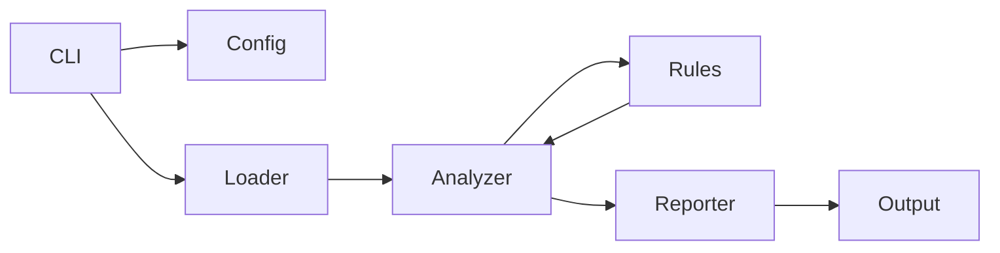

# CryptoAnalyzer Architecture

## 1. Overview

CryptoAnalyzer is designed as a modular static-analysis framework for detecting cryptographic vulnerabilities in Python code. Its architecture is divided into the following main layers:

1. **Entry Point (CLI)**  
2. **Configuration Loader**  
3. **Source Discovery**  
4. **Analysis Engine**  
5. **Rule Library**  
6. **Reporting Subsystem**  
7. **Utilities**

Each layer interacts via well-defined interfaces, enabling extensibility and maintainability.

## 2. Component Breakdown

### 2.1 CLI (`cli.py`)
- **Responsibilities**:
  - Parse command-line arguments (target path, format, config, output).
  - Display an ASCII-art banner.
  - Orchestrate workflow: clone GitHub repos, discover files, run analysis, generate reports.
  - Handle errors gracefully (syntax errors, missing files, git issues).
- **Key functions**:
  - `print_banner()`
  - `main()`

### 2.2 Configuration Loader (`config.py`)
- **Responsibilities**:
  - Locate and parse configuration from TOML, YAML, or INI.
  - Expose settings (e.g., `disabled_rules`).
- **Interface**:
  - `Config.load(path: Optional[str]) -> Config`

### 2.3 Source Discovery (`loader.py`)
- **Responsibilities**:
  - Identify `.py` files to analyze.
  - Support:
    - Local directories (recursive).
    - Single files or glob patterns.
    - GitHub URLs (shallow clone via `git clone --depth 1`).
- **Interface**:
  - `discover_source_files(target: str, config: Config) -> List[str]`

### 2.4 Analysis Engine (`analyzer.py`)
- **Responsibilities**:
  - Parse each Python file into an AST.
  - Dynamically discover and load all rule modules.
  - Apply each rule’s `check(tree, file_path)` to the AST.
  - Aggregate `Finding` objects.
- **Workflow**:
  1. `ast.parse(source)`
  2. For each rule:
     ```python
     findings += rule.check(tree, file_path)
     ```
  3. Return consolidated findings list.

### 2.5 Rule Library (`rules/`)
- **Organization**:
  - Subdirectories by category:
    - `credentials/`
    - `randomness/`
    - `algorithm_params/`
    - `cleartext/`
- **Rule Interface** (`Rule` base class):
  ```python
  class Rule:
      @property def name(self) -> str
      @property def description(self) -> str
      @property def cwe_ids(self) -> List[str]
      def check(self, tree: ast.AST, file_path: str) -> List[Finding]
  ```
- **Auto-Discovery**:
  - Uses `pkgutil.walk_packages` to find and import all `rules` modules.

### 2.6 Reporting Subsystem (`reporter/`)
- **Formatters**:
  - **JSONReporter**: outputs deduplicated JSON array.
  - **CsvReporter**: outputs CSV with header `file,line,col,rule,message,cwe_id`.
  - **HtmlReporter**: generates a styled HTML table, auto-opens in browser.
- **Interface**:
  - Each reporter implements:
    ```python
    def format(findings: List[Finding]) -> str
    ```

### 2.7 Utilities (`utils/`)
- **AST Helpers** (`ast_utils.py`):
  - Functions for attribute resolution, literal detection, dict-key extraction.
- **File Helpers** (`file_utils.py`):
  - File writing, directory creation.
- **Logging** (`logger.py`):
  - Standardized logging setup.

## 3. Data Flow



1. **CLI** reads args → loads **Config**.  
2. **CLI** invokes **Loader** to get file list.  
3. **Analyzer** parses each file and applies **Rules**.  
4. **Analyzer** returns findings → **Reporter** formats them.  
5. **CLI** writes or displays the report.

## 4. Extensibility Points

- **Adding Rules**: Drop a new module under `rules/`; no code changes elsewhere.  
- **Adding Report Formats**: Create new reporter in `reporter/` with a `format()` method and update `cli.py` for the `-f` choice.  
- **Configuration**: Extend `Config` to support new settings.

---

*This document describes the high-level architecture of CryptoAnalyzer, demonstrating its modular design and enabling future growth.*